<div align="center">

```text
 ________  ________  ________   ________ ___  ________     
|\   ____\|\   __  \|\   ___  \|\  _____\\  \|\   ____\    
\ \  \___|\ \  \|\  \ \  \\ \  \ \  \__/\ \  \ \  \___|    
 \ \  \    \ \  \\\  \ \  \\ \  \ \   __\\ \  \ \  \  ___  
  \ \  \____\ \  \\\  \ \  \\ \  \ \  \_| \ \  \ \  \|\  \ 
   \ \_______\ \_______\ \__\\ \__\ \__\   \ \__\ \_______\
    \|_______|\|_______|\|__| \|__|\|__|    \|__|\|_______|
                                                           
                                                           
                                                           
     ________ ___  ___       _______   ________            
    |\  _____\\  \|\  \     |\  ___ \ |\   ____\           
    \ \  \__/\ \  \ \  \    \ \   __/|\ \  \___|_          
     \ \   __\\ \  \ \  \    \ \  \_|/_\ \_____  \         
      \ \  \_| \ \  \ \  \____\ \  \_|\ \|____|\  \        
       \ \__\   \ \__\ \_______\ \_______\____\_\  \       
        \|__|    \|__|\|_______|\|_______|\_________\      
                                         \|_________|      
                                                           
```


---

### Overview
This repository serves as a **personal backup** and a **showcase** for my Linux configuration files. It features two distinct setups: a cutting-edge **CachyOS (Wayland/Sway)** environment and a polished **Ubuntu (X11)** backup.

[**Explore CachyOS Setup**](./cachyOS-config-files) • [**Explore Ubuntu Setup**](./ubuntu-config-files)

</div>

## CachyOS rice
my main setup optimized for performance and aesthetics

### key features
- **window manager:** [Sway](https://swaywm.org/) for a lightweight, modular Wayland experience.
- **visualizer:** Custom [Cava](https://github.com/karlstav/cava) setup featuring GLSL shaders (`northern_lights`, `eye_of_phi`).
- **custom terminal based DRPC:** Custom Discord Rich Presence scripts for specialized apps (ArduinoIDE, Kdenlive, Tinkercad).
- **scripts for both KDE plasma and sway WM:** 
    - `battery_sentinel.sh` for power monitoring.
    - `pomodoro-kclock.sh` for productivity tracking.
    - `focus.sh` for distraction-free work.
- **Terminal:** [Kitty](https://swapp.com/) with a curated theme collection.

<div align="center">
  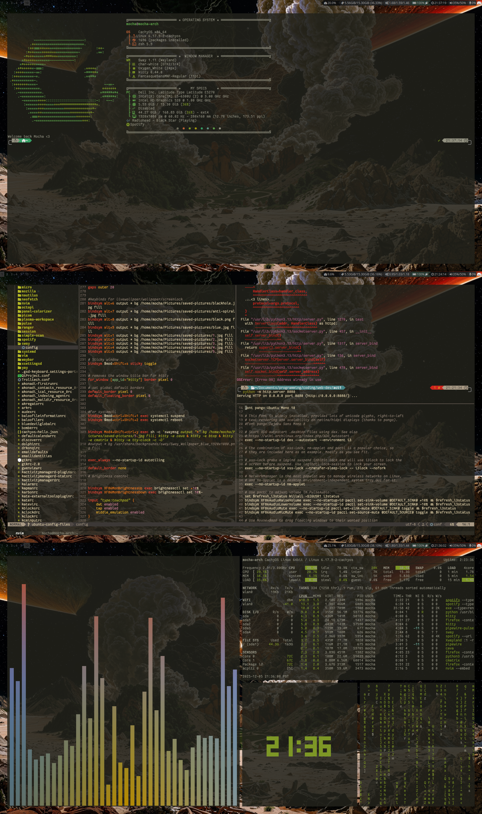
  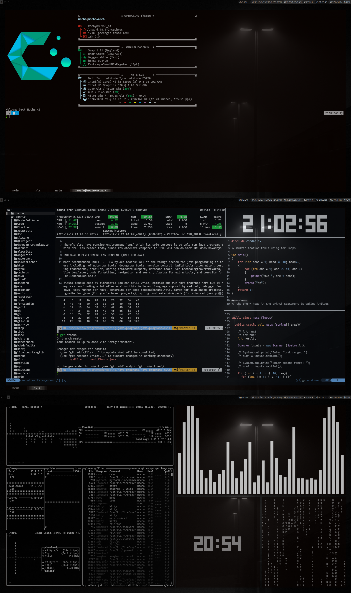
  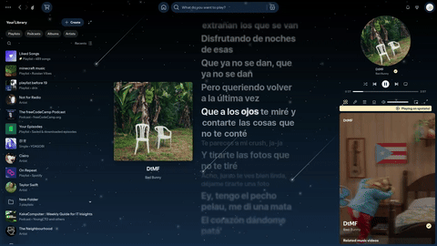
  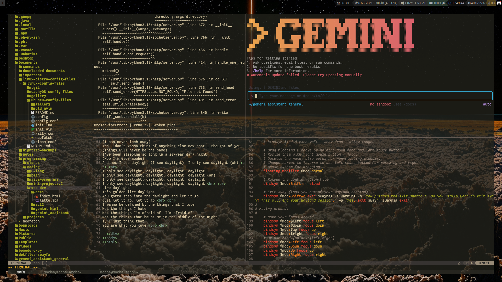
  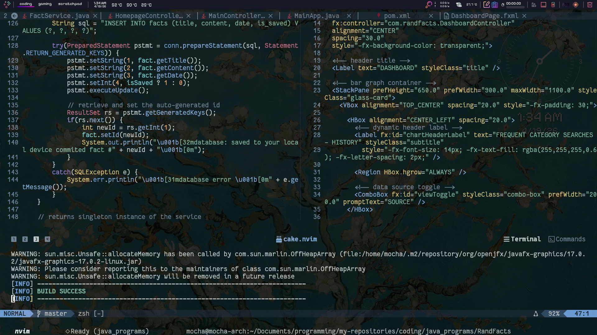
  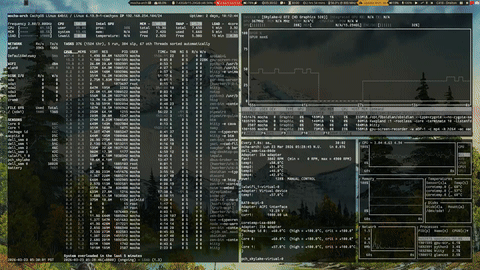
  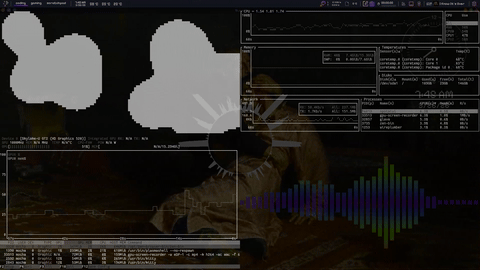
  
  
  

</div>

---

## Ubuntu configs files
X11-based setup 

### key features
- **Compositor:** [Picom](https://github.com/yshui/picom) with blur and transparency configurations.
- **Fetch:** Custom [Neofetch](https://github.com/dylanaraps/neofetch) branding.
- **Terminal:** Pre-configured Kitty and Zsh environments.
- **Editor:** Classic Vim/Neovim backup configurations.

<div align="center">
  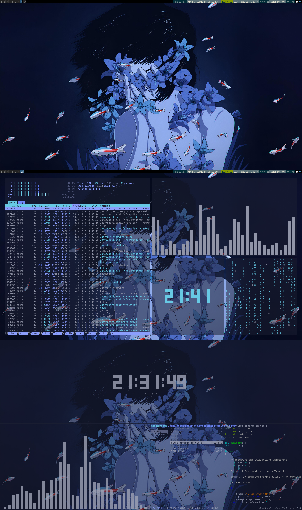
  
  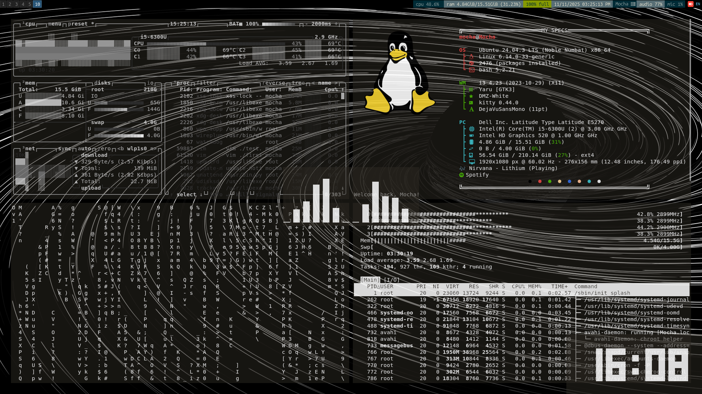
  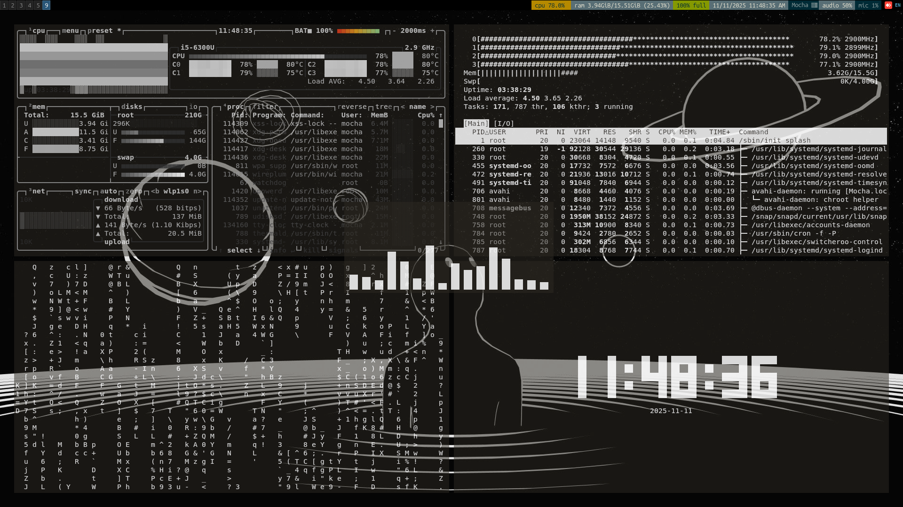
  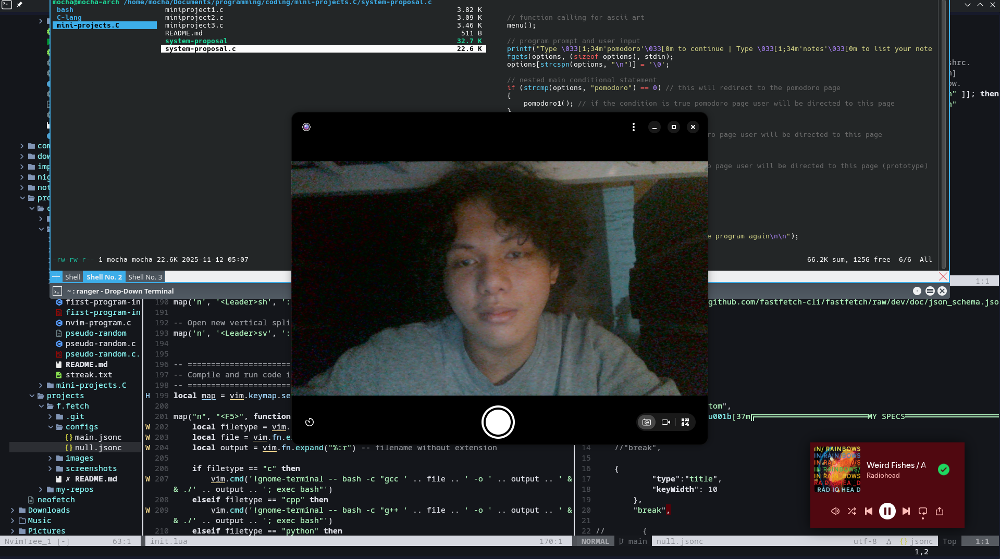
  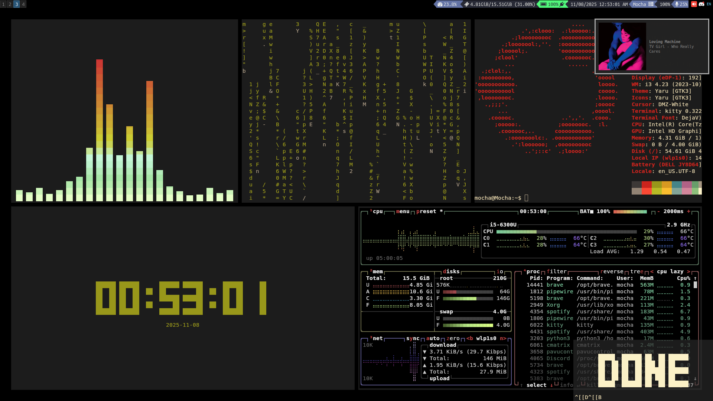
</div>

---

## NVIM
fully modular lazy loaded config 

- **Package Manager:** [Lazy.nvim](https://github.com/folke/lazy.nvim) for sub-50ms startup.
- **Plugins:**
    - **status bar:** `lualine.lua` 
    - **file nav:** `oil.lua` (file manipulation), `telescope` (fuzzy finding), `bufferline.lua` (multiple tabs), `neotree.lua` (flexible file explorer)
    - **DRPC:** `cord.lua` for native Discord RPC integration.
    - **terminal** `cake.lua` for floating and dynamic terminal
- **theming:** dynamic theme switching via `themes.lua`.
- **core config:** `init.lua`
- **repo heatmaps and stats** `wrraped.lua`

for more info about my nvim set up you can visit this [repository](https://github.com/frtzhahn/nvim-setup)


